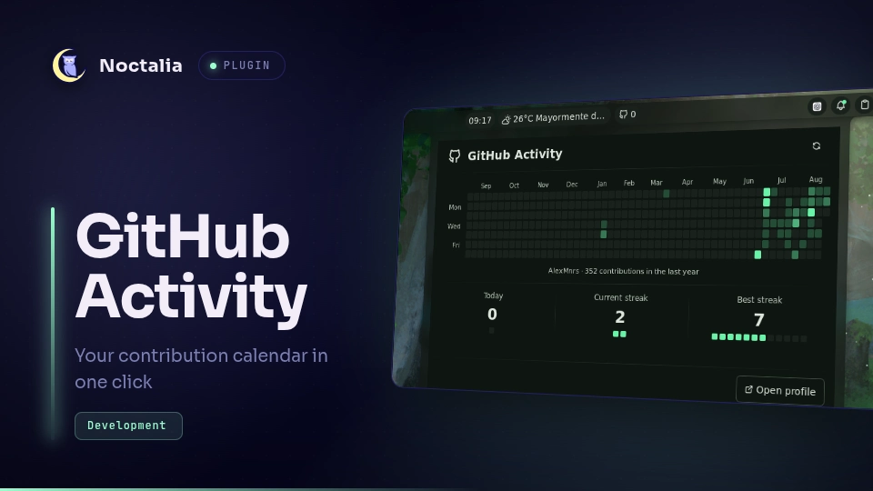

# GitHub Activity

A native GitHub contribution calendar for the Noctalia v5 bar. Its compact
widget can show today's contributions, the current streak, the annual total,
or only the GitHub icon, and opens an adaptive, theme-aware annual heatmap on
click.



## Plugin

| Field | Value |
| --- | --- |
| Plugin ID | `alexmnrs/github-activity` |
| Entries | Bar widget: `activity`; panel: `calendar`; service: `sync` |
| Minimum Noctalia plugin API | `24` (Noctalia v5.0.0-beta.9) |

## Requirements

- [GitHub CLI](https://cli.github.com/) (`gh`), authenticated with the account
  whose activity you want to display.
- `xdg-open` (`xdg-utils` on Arch) to open the profile button.

Authenticate once before enabling the plugin:

```bash
gh auth login -h github.com
```

## Usage

1. Enable **GitHub Activity** in Noctalia's plugin manager.
2. Add the `activity` widget to a bar from the widget picker.
3. Left-click the widget to open the annual calendar.
4. Right-click the widget or use the panel's refresh button to refresh now.

## Settings

| Setting | Options | Default |
| --- | --- | --- |
| Automatic refresh interval | 15, 30, or 60 minutes | 30 minutes |
| Widget display | Icon and value, or icon only | Icon and value |
| Widget metric | Today's contributions, current streak, or annual total | Today's contributions |
| Show today's contributions | On or off | On |
| Show current streak | On or off | On |
| Show best streak | On or off | On |
| Show annual total | On or off | On |
| Show profile button | On or off | On |

Changing the interval applies it immediately and requests a refresh unless a
request is already in progress. The widget tooltip and calendar panel show the
last update time and selected automatic refresh interval.

Widget display and metric choices belong to each bar-widget instance. Multiple
copies of GitHub Activity can therefore show different metrics. The metric
selector is relevant only when the widget is configured to show a value.

Panel content choices apply to the shared calendar panel. Hiding the annual
total leaves the hovered-day detail available. Hiding today's contributions,
the current streak, and the best streak together adds row spacing and centers
the ready content for a more legible focused view.

Plugin interface text comes from `translations/en.json` and is translated
through Noctalia Translate. Calendar month and weekday labels instead use
Noctalia's date formatter and follow the process `LC_TIME` locale.

The panel can also be toggled through IPC:

```bash
noctalia msg panel-toggle alexmnrs/github-activity:calendar
```

Request a refresh externally with:

```bash
noctalia msg plugin alexmnrs/github-activity:sync all refresh
```

## Data and privacy

The plugin runs `gh api graphql` to request the authenticated account's
`contributionCalendar`. It never reads, writes, or displays a GitHub token.
Authentication remains entirely inside GitHub CLI.

The latest successful normalized calendar is cached in Noctalia's per-plugin
data directory. The cache contains the public contribution dates, counts,
levels, username, and fetch time; it contains no credentials. It lets the
widget continue to show the last known activity when offline.

## Troubleshooting

- **GitHub CLI is required:** install `github-cli` (or your distribution's
  `gh` package).
- **GitHub CLI needs authentication:** run `gh auth login -h github.com`.
- **No data after a refresh:** run `gh auth status` in a terminal, then retry.
- **The profile button does nothing:** install `xdg-utils` so `xdg-open` is
  available.

## Compatibility

Noctalia v5's plugin API is beta and can change before the stable release. This
plugin targets API 24 and uses Noctalia's declarative panel and shared-state
APIs only.
