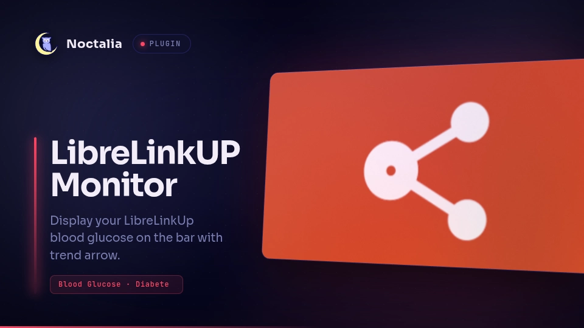

# LibreLinkUp



Display your current LibreLinkUp blood glucose on the bar with a trend arrow,
using the LibreView API.

## Plugin

| Field | Value |
| --- | --- |
| ID | `cleboost/librelinkup` |
| Entries | Bar widget: `glucose`; service: `fetcher` |

## Requirements

Install `sha256sum` on `PATH` (usually from `coreutils`). A LibreLinkUp account
with at least one active glucose connection is required.

## Usage

1. Install the plugin and add the `glucose` bar widget.
2. Open plugin settings and enter your LibreLinkUp email and password.
3. The bar shows the latest reading and trend arrow, for example `120 ↗`.
4. Hover for the tooltip with the measurement timestamp.
5. Click the widget to force a refresh.

Force a refresh from the CLI:

```sh
noctalia msg plugin cleboost/librelinkup:fetcher all refresh
```

## Settings

| Setting | Type | Default | Description |
| --- | --- | --- | --- |
| `email` | `string` | *(empty)* | LibreLinkUp account email used for authentication. |
| `password` | `string` | *(empty)* | LibreLinkUp account password. |
| `refresh_interval` | `int` | `300` | How often glucose data is refreshed, in seconds (60–900). |
| `low_threshold` | `int` | `70` | Values below this level are shown in error color. |
| `high_threshold` | `int` | `180` | Values above this level are shown in warning color. |
| `glyph` (widget) | `glyph` | `droplet` | Icon shown in the bar for the `glucose` widget. |
| `show_unit` (widget) | `bool` | `false` | Append `mg/dL` after the glucose value on the bar. |

## IPC

```sh
noctalia msg plugin cleboost/librelinkup:fetcher all refresh
```

The `refresh` event fetches the latest glucose reading immediately. It takes
no payload.

## Notes

- Credentials stay in Noctalia plugin settings; they are not hard-coded in the
  plugin.
- The plugin calls `api.libreview.io` (or a regional LibreView endpoint after
  login redirect) over HTTPS. No other network access is made.
- `sha256sum` derives the LibreLinkUp `Account-Id` header from the logged-in
  user id.
- Regional LibreView redirects are handled automatically after login.
- Default refresh interval is 5 minutes.

## Disclaimer

This plugin is an independent community project. It is **not affiliated with,
endorsed by, or supported by Abbott** (or Abbott Diabetes Care). LibreLinkUp,
LibreView, and FreeStyle Libre are trademarks of Abbott.

The plugin talks to LibreView endpoints using behaviour observed from the
official mobile apps. That API is **not publicly documented** and may change
without notice. Abbott may restrict, suspend, or terminate access if it detects
unusual use.

This software is provided **as is**, without warranty of any kind. The author
accepts **no liability** for login failures, missing or incorrect readings,
account restrictions, service outages, or any other issue arising from its use.
It is intended for convenience on your desktop only — **not for medical
decisions**. Always rely on your sensor, reader, or clinician-approved tools for
treatment choices.
