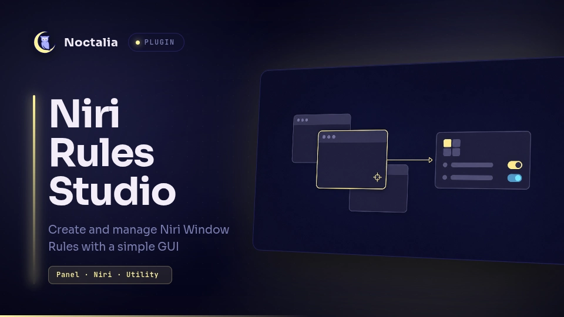

# Niri Rules Studio

Create and manage Niri window rules without editing KDL by hand. The plugin
inspects open windows, builds a rule from their app ID, and validates every
change with Niri before applying it.



## Plugin

| Field | Value |
| --- | --- |
| ID | `setyvii/niri-rules-studio` |
| Entries | Bar widget: `rules`; panel: `panel` |

## Requirements

- Niri and the `niri` command on `PATH`.
- Write access to the selected Niri configuration file.

## Usage

Enable the plugin and add its `rules` widget to the bar. Click the widget to
open the panel. Middle-click opens the plugin settings.

The panel can also be opened from a terminal:

```sh
noctalia msg panel-toggle setyvii/niri-rules-studio:panel
```

Use the focused window, the on-screen picker, or the searchable window list to
choose an application. A rule can control:

- tiled, floating, fullscreen, or maximized opening behavior;
- the initial size of tiled and floating windows;
- the workspace or output where a window opens;
- an optional title regular expression.

The **Managed rules** page lets you edit, disable, or delete rules created by
the plugin. Opening rules only affect new windows.

## Settings

| Setting | Type | Default | Description |
| --- | --- | --- | --- |
| `niri_config` | `file` | `~/.config/niri/config.kdl` | Root configuration that receives the managed include and is passed to `niri validate`. |

Change this setting when Niri uses a different root file through `--config` or
`NIRI_CONFIG`.

## Files written

For the default configuration path, the plugin writes:

- `~/.config/niri/cfg/noctalia-rules-studio.kdl` — generated window rules;
- `~/.config/niri/.noctalia-rules-studio-backups/` — backups made before a
  managed file or root configuration is replaced;
- `rules.json` in Noctalia's plugin data directory — the editable rule model.

On the first save it adds this block to the selected root configuration:

```kdl
// BEGIN NIRI RULES STUDIO
include "./cfg/noctalia-rules-studio.kdl"
// END NIRI RULES STUDIO
```

For now, the plugin only manages rules created through its interface. Importing
or editing rules from other KDL files may be added in a future version.

## Validation

Before applying a change, the plugin writes temporary candidate files beside
the selected root configuration and runs:

```sh
niri validate -c /path/to/.noctalia-rules-studio.validate.kdl
```

Keeping the temporary root in the same directory preserves relative includes.
If validation fails, the active configuration is left unchanged.

App IDs selected from Niri are escaped and stored as exact regular-expression
matches. A title entered manually remains a regular expression.
