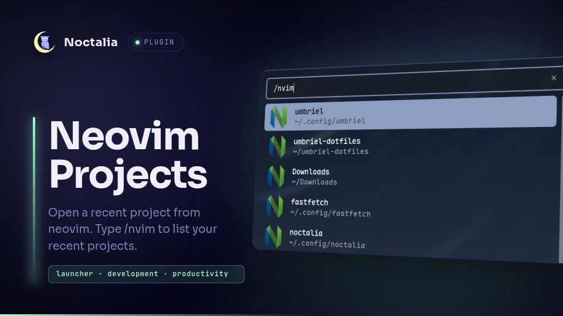

# Neovim Projects

Quickly search and launch recent Neovim workspaces and project directories directly from the Noctalia launcher.

## Plugin

| Field | Value |
| --- | --- |
| ID | `ashur-d/nvim-projects` |
| Entry | Launcher provider: `provider` |
| Launcher Prefix | `/nvim` |

## Requirements

Ensure `nvim` is available on your system `PATH`. Projects open using Noctalia's default terminal discovery, or any custom terminal emulator configured in settings.

## Usage

Open the Noctalia launcher and type `/nvim` to list recent local Neovim sessions and workspaces. Continue typing to filter projects by name or path, then select one to open it in your terminal running Neovim.

## Settings

| Setting | Type | Default | Description |
| --- | --- | --- | --- |
| `max_results` | `int` | `20` | Maximum number of recent projects to show in the launcher. |
| `projects_dir` | `folder` | `~/Projects` | Directory where your local projects and git repositories reside. |
| `terminal` | `string` | `""` | Custom terminal command to launch Neovim (leave empty to use Noctalia's default terminal). |

## Notes

- Sessions are automatically decoded from `persistence.nvim` state files located at `~/.local/state/nvim/sessions/`.
- The plugin also scans subdirectories in your configured `projects_dir`, as well as `~/.config/nvim`.
- Opens each project with `cd <dir> && nvim .` using `noctalia.runInTerminal` (or your configured custom terminal).
