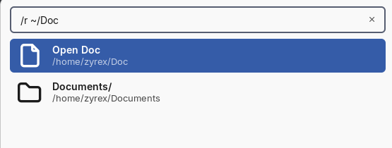
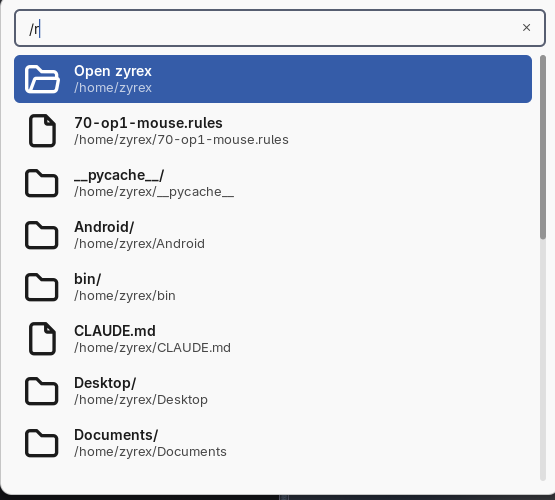
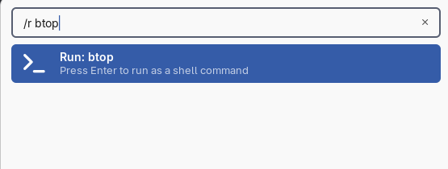
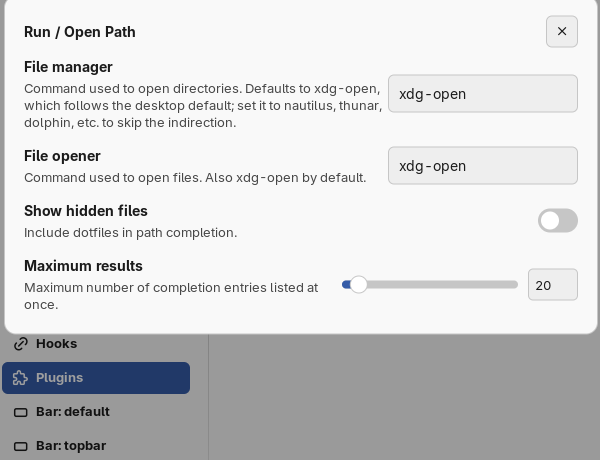

# Run / Open Path

A "run or open" prompt built on Noctalia's own launcher. Type a path and it
completes as you type; Enter opens it in your file manager. Type anything
that isn't a path and Enter runs it as a shell command.

## Plugin

| Field | Value |
| --- | --- |
| ID | `zyrex/run-path` |
| Entry | Launcher provider: `run-path` |
| Launcher Prefix | `/r` |

## Requirements

Needs only a file opener; `xdg-open` (part of `xdg-utils`) is the default and
follows your desktop's file associations, so most people won't need to change
it.

## Usage

Open the launcher and type `/r` followed by a path or a command:

```
/r ~/Doc          →  Documents/            (completion)
/r ~/Documents    →  Open Documents        (Enter → file manager)
/r /etc/fstab     →  Open fstab            (Enter → default handler)
/r btop           →  Run: btop             (Enter → sh -c btop)
```

- **Path mode** is chosen when the input starts with `/`, `~` or `.`. Everything
  else is command mode.
- **The first row is always "Open ⟨name⟩"** for whatever the input currently
  resolves to, and the launcher preselects it — so typing a path and pressing
  Enter opens it.

  

- **Activating a directory row below it descends** into that directory
  instead of opening it (via `launcher.setQuery`), so the list doubles as
  navigation without a second keybind.
- `~` expands to your home directory. `.` and `..` resolve **against your
  home directory**, not a process working directory — the launcher has none.
- An empty input lists your home directory, so the keybind on its own is
  useful:

  

- Anything that isn't path-like runs as a shell command via `sh -c` when
  activated:

  

Bind it in your compositor. For Hyprland:

```
bind = SUPER, R, exec, noctalia msg panel-toggle launcher "/r "
```

## Settings



| Setting | Type | Default | Description |
| --- | --- | --- | --- |
| `file_manager` | `string` | `xdg-open` | Command used to open directories. Set to `nautilus`, `thunar`, `dolphin`, etc. to skip the `xdg-open` indirection. |
| `file_opener` | `string` | `xdg-open` | Command used to open files. |
| `show_hidden` | `bool` | `false` | Include dotfiles in path completion. |
| `max_results` | `int` | `20` | Maximum number of completion entries listed at once. |

## Notes

- Completion is prefix-based (case-insensitive), not fuzzy: typing `~/Doc`
  matches `Documents/` but not, say, a folder named `MyDocs`.
- Commands run detached with no terminal (`sh -c <command>`, no output
  shown). There is no "run in terminal" mode.
- A path containing a literal `~` other than at the very start is not
  un-expanded — only a leading `~` is treated specially.
