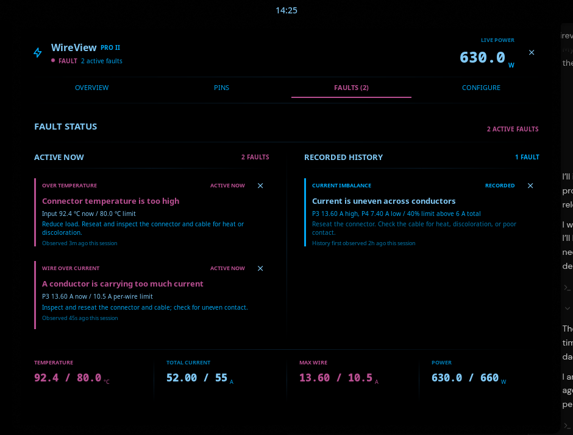

# WireView Pro II

Live WireView Pro II telemetry for Noctalia Shell v5, with a dense power-flow
dashboard, six-conductor detail, fault registers, graphs, and guarded device
configuration.



## Plugin

| Field | Value |
| --- | --- |
| ID | `gustav0ar/wireview-pro-ii` |
| Service | `monitor` |
| Bar widget | `summary` |
| Panel | `dashboard` |

## Requirements

- A running [`wireviewd`](https://github.com/Gustav0ar/wireview-pro-ii) API 1 or
  API 2 daemon and its default Varlink socket at
  `/run/wireviewd/io.github.Gustav0ar.WireView`.
- `python3`, used by the bundled direct Varlink transport.
- `sleep`, used only to pace monitor reconnection after the daemon restarts.

The plugin does not invoke the `wireview` CLI or `varlinkctl`. Its bundled
transport opens the Unix socket and reads and writes NUL-framed Varlink messages
directly. The service validates the daemon API and required capabilities before
consuming telemetry or changing settings.

## Usage

Add the `summary` widget to a Noctalia bar and click it to open the dashboard
attached to the bar below the clicked widget. Noctalia's plugin settings expose
the standard Attached / Floating selector if you prefer a detached panel. The
panel can also be opened directly:

```sh
noctalia msg panel-toggle gustav0ar/wireview-pro-ii:dashboard
```

The Overview tab shows live total power, a two-minute graph, all six conductors,
temperatures, current, voltage, and fan duty. Pins expands the conductor data.
Faults preserves active, logged, and unknown register bits.

Active alarms remain in the theme's danger color while recorded history is
deliberately quieter. Fault timing is labeled as session-observed: the current
daemon API timestamps telemetry samples, not individual fault transitions.

If live samples stop, the panel keeps the last values visible but dims them and
labels them as frozen. The bar widget also changes its secondary value to
`STALE`. Nothing stale is presented as a current reading.

The default Faults layout is side by side. For constrained displays, select
`Stacked` under the dashboard's plugin settings; the page becomes one scrolling
column without removing any alarm detail or action.

## Settings

- **Fault page layout**: show active and recorded faults side by side, or stack
  them vertically on narrow displays.

## Device configuration

Configure edits a deliberately small set of daemon-validated settings:

- Fan mode, temperature source, and minimum/maximum duty
- Immediate screen selection, plus backlight, sensor averaging, device logging
  interval, and the default screen used after startup
- Runtime daemon telemetry polling interval
- Fault limits for temperature, total current, per-wire current, total power,
  conductor imbalance, and the imbalance minimum load

The Faults view can clear each active or recorded alarm directly on the
WireView device. An over-limit conductor also shows a compact clear action in
its pin row. If the electrical or thermal condition is still present, the device will
assert the alarm again and the plugin will continue to show it. Each action
reports clearing, success, failure, or immediate reassertion on the affected
fault row.

`Apply until reload` changes active settings only. `Review permanent store`
requires a second explicit action before changed device settings are written to
nonvolatile memory. Daemon polling is runtime-only and is never presented as a
permanent device setting.

## Transport

The service subscribes to `Monitor` and coalesces events into `GetTelemetry`
requests. Graph history lives only in Noctalia shared state and is capped at 120
samples. Configuration uses `GetConfiguration`, `GetPollInterval`,
`SetConfigurationItem`, and `SetPollInterval`. The runtime screen selector uses
`SetScreen` and also follows screen changes reported by `Monitor`. Alarm reset
uses `ClearFaults` and consumes the device's refreshed telemetry response.

Every mutation is allowlisted in the plugin and validated again by wireviewd.
Persistent changes send `confirm=true` at the Varlink boundary.

For development, run the read-only transport contract check against a
disposable daemon socket:

```sh
python tests/check_varlink.py /tmp/wireviewd-test.sock
```
